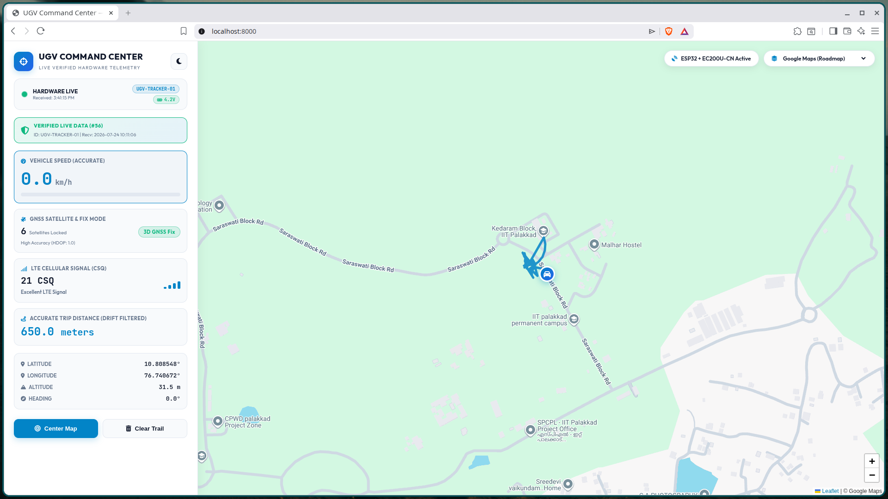

# UGV Tracker — Cellular LTE 4G / GNSS Fleet Telemetry Stack

[](https://www.espressif.com/en/products/socs/esp32)
[]()
[](https://fastapi.tiangolo.com)
[](https://leafletjs.com)

> **Standalone IoT Cellular Fleet Telemetry & Anti-Theft Tracking Subsystem**  
> Developed as part of the Autonomous Agricultural Rover Platform at **IIT Palakkad (Department of Electrical Engineering)**.

---

## 📌 Overview

`UGV_Tracker` is an autonomous, standalone IoT telemetry and anti-theft tracking unit designed for Unmanned Ground Vehicles (UGVs). It operates completely independently of the primary vehicle compute and powertrain, ensuring uninterrupted real-time telemetry, location tracking, and battery health monitoring even if the main robot is shut down.



---

## 🏗️ System Architecture

```
+-------------------------------------------------------------+
|                     EDGE TRACKER UNIT                       |
|                                                             |
|   +-------------------+             +-------------------+   |
|   |  ESP32 MCU        |<--- UART ---| Quectel EC200U    |   |
|   |  - PlatformIO C++ |             | - 4G LTE Cat 1    |   |
|   |  - AGPS Control   |             | - GNSS Engine     |   |
|   |  - Power Manager  |             | - HTTP Client     |   |
|   +-------------------+             +-------------------+   |
+-------------------------------------------------------------+
                                │
                        4G LTE Cellular Link
                                │
                                ▼
+-------------------------------------------------------------+
|                      CLOUD BACKEND                          |
|                                                             |
|   +-----------------------------------------------------+   |
|   | FastAPI REST Server                                 |   |
|   | • Ingests GPS coords, speed, battery, RSSI, HDOP   |   |
|   | • SQLite persistent storage (UTC / IST conversions) |   |
|   | • Historical telemetry CSV exports                  |   |
|   +-----------------------------------------------------+   |
+-------------------------------------------------------------+
                                │
                                ▼
+-------------------------------------------------------------+
|                 OPERATOR WEB DASHBOARD                      |
|                                                             |
|   • Dark-mode responsive Leaflet.js live interactive map    |
|   • Breadcrumb historical path visualization                |
|   • Battery voltage, satellite count, and connectivity KPIs |
+-------------------------------------------------------------+
```

---

## 🚀 Features

* **High-Speed AGPS Satellite Acquisition:** Utilizes Assisted-GPS commands (`AT+QGPSCFG="agpsbyap",1`) to achieve fast cold-start TTFF (Time-To-First-Fix).
* **Robust AT Command Parser:** Resilient Quectel modem state machine handling automated network re-registration, signal quality checks (CSQ), and HTTP payload posting.
* **Dual Power Architecture:** Supports both 24/7 continuous tracking test mode and ultra-low-power sleep cycles.
* **Full-Featured Telemetry Dashboard:** Real-time web application displaying live coordinates, rover heading, battery level, satellite count (HDOP), and packet timestamps.

---

## 📁 Repository Structure

```
UGV_Tracker/
├── src/                               ← ESP32 Firmware Source (C++)
│   ├── main.cpp                       ← Application setup and main loop
│   ├── EC200U.cpp                     ← Quectel AT command driver & HTTP client
│   ├── Tracker.cpp                    ← State machine & telemetry sequencer
│   └── GPS.cpp                        ← NMEA sentence parser & AGPS handler
│
├── include/                           ← Firmware Header Files
│   ├── Config.h                       ← APN, server URLs, and pin definitions
│   ├── EC200U.h                       ← Modem control interfaces
│   └── Types.h                        ← Telemetry struct definitions
│
├── backend/                           ← Cloud Ingestion & Dashboard Backend
│   ├── main.py                        ← FastAPI REST API & static file server
│   ├── database.py                    ← SQLite DB models & queries
│   ├── requirements.txt               ← Python dependencies
│   └── static/                        ← HTML5 / CSS / Leaflet.js web frontend
│
├── screenshots/                       ← Dashboard & Field Testing Visuals
├── platformio.ini                     ← PlatformIO Project Configuration
└── render.yaml                        ← Cloud deployment configuration
```

---

## 🛠️ Getting Started

### 1. ESP32 Firmware Flashing (PlatformIO)
1. Install [PlatformIO](https://platformio.org/) in VS Code or CLI.
2. Configure your APN and backend endpoint in [`include/Config.h`](include/Config.h).
3. Build and upload:
   ```bash
   pio run --target upload
   ```

### 2. Running Backend Server Locally
```bash
cd backend
pip install -r requirements.txt
uvicorn main:app --host 0.0.0.0 --port 8000 --reload
```
Open `http://localhost:8000` to view the live dashboard.

---

## 📜 Credits & Affiliation

* **Author:** Jagan J S
* **Affiliation:** Indian Institute of Technology Palakkad (Department of Electrical Engineering)
